  

  

<samp>I love my Creator · family · nature · cars · coffee</samp>

  

  

<picture>
  <source media="(prefers-color-scheme: dark)" srcset="https://raw.githubusercontent.com/Rider-io/Rider-io/output/github-snake-dark.svg" />
  
</picture>

  

